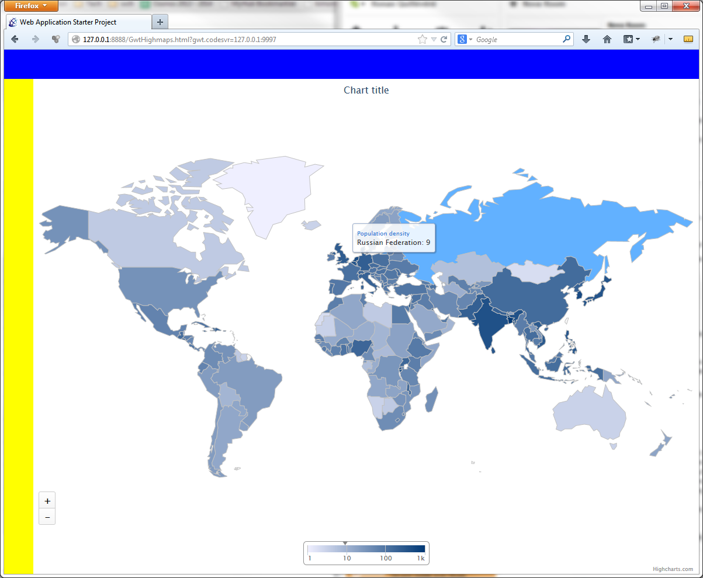

gwthighmaps
===========

Test usage of highcharts moxie wrapper 1.6 with highmaps 1.0.0-beta. See what is possible to do/use.

# What we had to implement

* new Class extending BaseChart<T> to define the "Map" type.
* Use Moxie wrapper to set options manually on chart
 
# What it looks like

# The code

The most important part is in [GwtHighmaps.java](./gwtapp/src/com/mycom/gwthighmaps/client/GwtHighmaps.java)

      // Define world map
      setWorldMap();
      // Define polygon data values
      setWorldData();

      final Map map = new Map();
      map.setTitle("test titre");

      map.setOption("/colorAxis/min", 1);
      map.setOption("/colorAxis/max", 1000);
      map.setOption("/colorAxis/type", "logarithmic");

      map.setOption("/mapNavigation/enabled", true);
      map.setOption("/mapNavigation/buttonOptions/verticalAlign", "bottom");

      Series series = map.createSeries().setName("Population density");
      series.setOption("/data", getWorldMap());
      series.setOption("/mapData", getWorldMapData());
      series.setOption("/joinBy", "code");

      map.addSeries(series);
      
      return map;

The [Map.java](./gwtapp/src/com/mycom/gwthighmaps/client/Map.java) class

     public class Map extends BaseChart<Map>
     {
     
        @Override
        protected String getChartTypeName()
        {
           return "Map";
        }
     
     }
