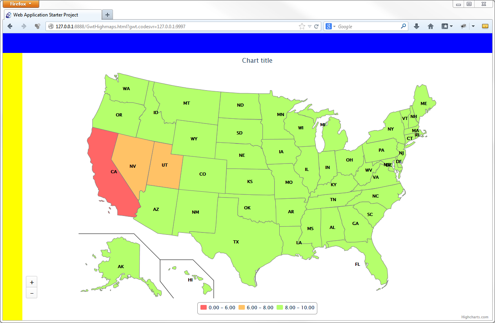

gwthighmaps
===========

Test usage of highcharts moxie wrapper 1.6 with highmaps 1.0.0-beta. See what is possible to do/use.

# What we had to implement

* New Class extending BaseChart<T> to define the "Map" type.
* Use Moxie wrapper to set options manually on chart
* Loader to be able to load a map
 
# What it looks like

# The code

We created a Loader interface. Its role is to provide the map and the data to the Highmaps library. We have 2 implementaions :

* [JsNativeLoader.java](./gwtapp/src/com/mycom/gwthighmaps/client/loader/js/JsNativeLoader.java)

Based on native methods that will set javascript variables directly into the document 

* [FileLoader.java](./gwtapp/src/com/mycom/gwthighmaps/client/loader/file/FileLoader.java)

Based on GWT ClientBundle to load a json file containing the data and transforming it to a JSONObject.

The [Map.java](./gwtapp/src/com/mycom/gwthighmaps/client/Map.java) class

     public class Map extends BaseChart<Map>
     {
     
        @Override
        protected String getChartTypeName()
        {
           return "Map";
        }
     
     }
